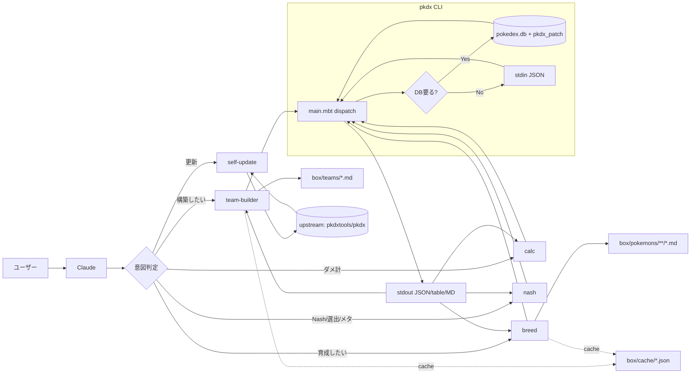
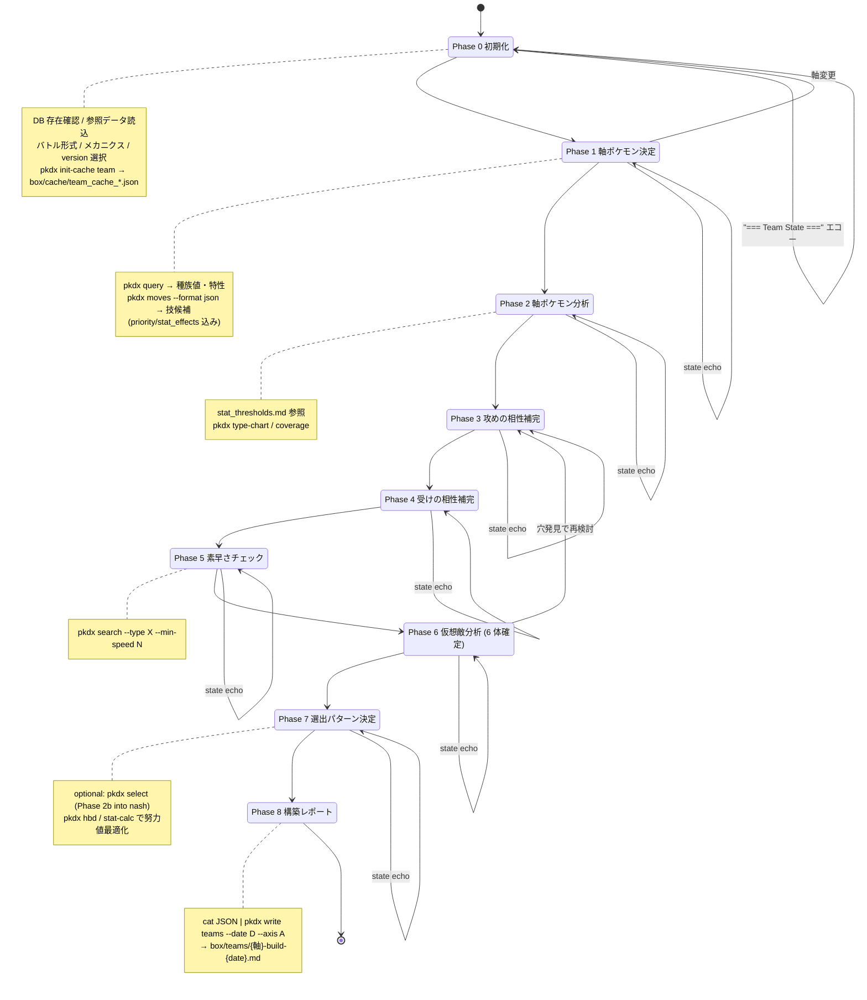
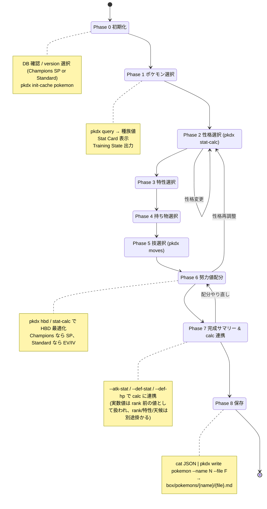
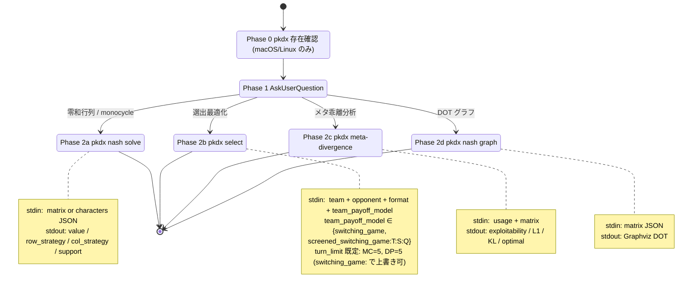
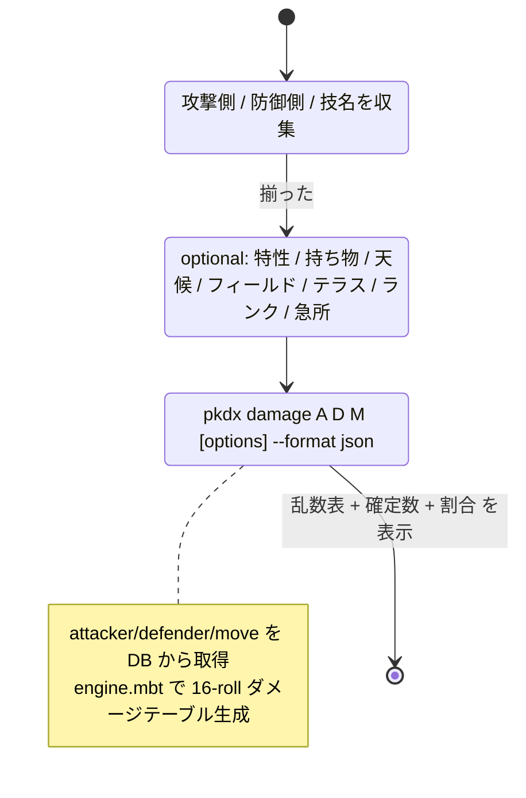
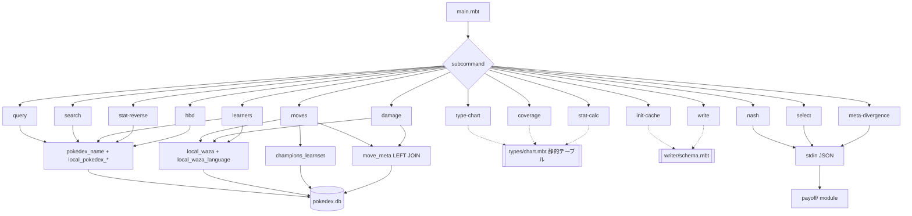
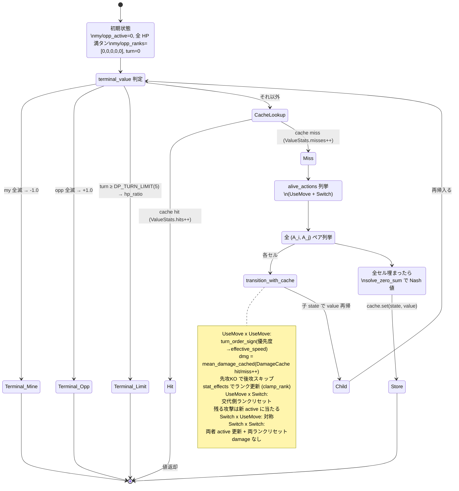
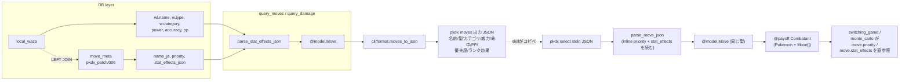

# pkdx アーキテクチャ: パスのステートマシン

ユーザー入力 → skill → CLI → DB → 出力 までの全パスを、粒度別に
ステートマシン / データフローとして可視化したもの。実装詳細は
各 skill の `SKILL.md` / `references/` を参照。

## 0. 全体像



## 1. team-builder (Phase 0 → 8)



## 2. breed (Phase 0 → 8)



## 3. nash / select / meta-divergence



## 4. calc (単純なステートマシン)



## 5. CLI dispatch → DB テーブルアクセスマップ



## 6. payoff 内部フロー (pkdx select の内側)

```mermaid
flowchart TD
  In[stdin JSON] --> Parse[cli_select::run_select]
  Parse --> Parsed{"team + opponent + format + model"}

  Parsed --> Disp{team_model}
  Disp -->|SwitchingGame| SG[switching_game_winrate]
  Disp -->|ScreenedSwitchingGame T:S:Q| SCR[team_payoff_matrix_screened]

  SG --> TPS[team_payoff_matrix_switching]

  SCR --> PhaseA["Phase A: team_monte_carlo_value × C(6,3)² cells"]
  PhaseA --> PhaseB["Phase B: mean-based row/col pruning (keep_top quantile)"]
  PhaseB --> PhaseC["Phase C: switching_game_winrate × retained sub-matrix"]
  PhaseC --> Sub[retained sub-matrix + retained indices]

  TPS --> Outer[outer Nash LP]
  Sub --> Outer

  Outer --> Build[build_select_result]
  Build --> Out[JSON: value / row_strategy / col_strategy / (retained) selections / exploitability]
```

## 7. SwitchingGame 内部ゲーム木 (再帰的ステートマシン)



## 8. データ型のフロー



## 補足 / 設計ポリシー

| 観点 | パス |
|---|---|
| **DB 一次アクセス** | `pkdx query/moves/damage/learners/search` のみ (1 箇所に集約) |
| **純 JSON I/O** | `pkdx select/nash/meta-divergence/write` は stdin / stdout のみ |
| **計算ホットループ内の DB 禁止** | payoff 層の `value` / `simulate_battle` は DB 触らず、全情報は `Move` と `Combatant` 経由 |
| **状態の永続化** | box/ 配下のみ (`teams/`, `pokemons/`, `cache/`) |
| **メタ的な状態エコー** | team-builder / breed は各 Phase 末尾に Team/Training State をエコーし、context 圧縮後も再開可能 |
| **ゲーム木状態** | `SwitchingGameState` は `derive(Eq, Hash)` の pure struct。memoize + αβ 互換 |
